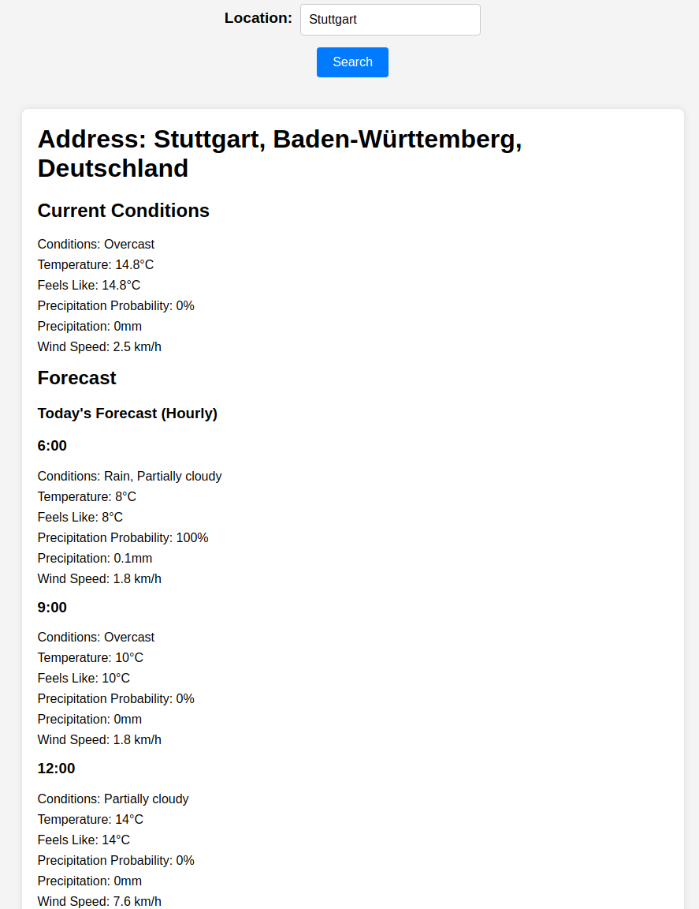

# ☀️ Weather App

This project is part of **The Odin Project's JavaScript curriculum**, where I developed a **Weather App** that fetches real-time weather data from an external API and displays it in a user-friendly interface. This project allowed me to practice working with **APIs**, **asynchronous JavaScript** (using `fetch`), and handling **JSON** data.

## 🌟 Features

- Fetches **real-time weather** data from the **OpenWeatherMap API**.
- Displays the current temperature and weather conditions.
- Users can search for weather by **city name**.

## 🚀 Technologies Used

- **HTML5**: For structuring the webpage.
- **CSS3**: For styling and responsive design.
- **JavaScript (ES6)**: For API requests and handling user interactions.
- **OpenWeatherMap API**: To fetch the weather data.

## 📸 Preview

You can view the Weather App here: [Live Demo](https://mrswizzer.github.io/odin-weather-app)

## 💡 Learning Outcomes

Through this project, I improved my understanding of:

- **APIs**: How to fetch data from a third-party service and handle **JSON** responses.
- **Asynchronous JavaScript**: Using **`async`/`await`** and the **`fetch`** API to handle asynchronous data.
- **DOM manipulation**: Dynamically updating the webpage based on API data.

---

## 🔗 Acknowledgments

This project was created as part of [The Odin Project](https://www.theodinproject.com/)'s curriculum. Special thanks to the OpenWeatherMap for providing the API service.
